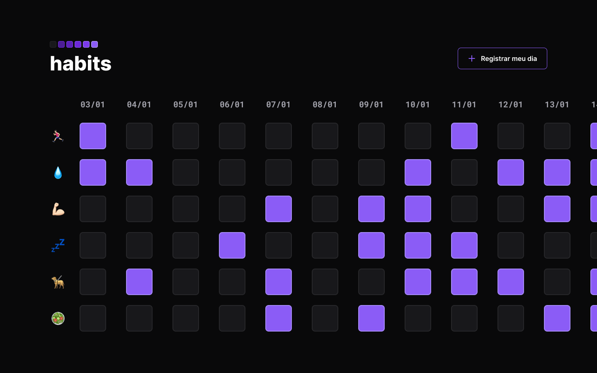

<h1 align="center">Habits</h1>

Projeto web realizado no programa NLW da rocketseat em janeiro de 2023.  

  

## Tecnologias

Esse projeto foi desenvolvido com as seguintes tecnologias:

- HTML e CSS
- JavaScript
- Git e GitHub
- Figma

## Projeto

Esse projeto é um controlador/registrador de hábitos, onde você registra no dia a dia hábitos que foram executados ou não.

- [Visite o projeto online](https://rhuanalmeida.github.io/nlwSetup)

- Você pode visitar o layout desse projeto atraves [DESSE LINK](<https://www.figma.com/file/v7dwWUPs4gsMiLVjBQukZ1/Habits-(e)-(Community)?node-id=75%3A567&t=JKiKwThX6dWN3Pqs-0>)
